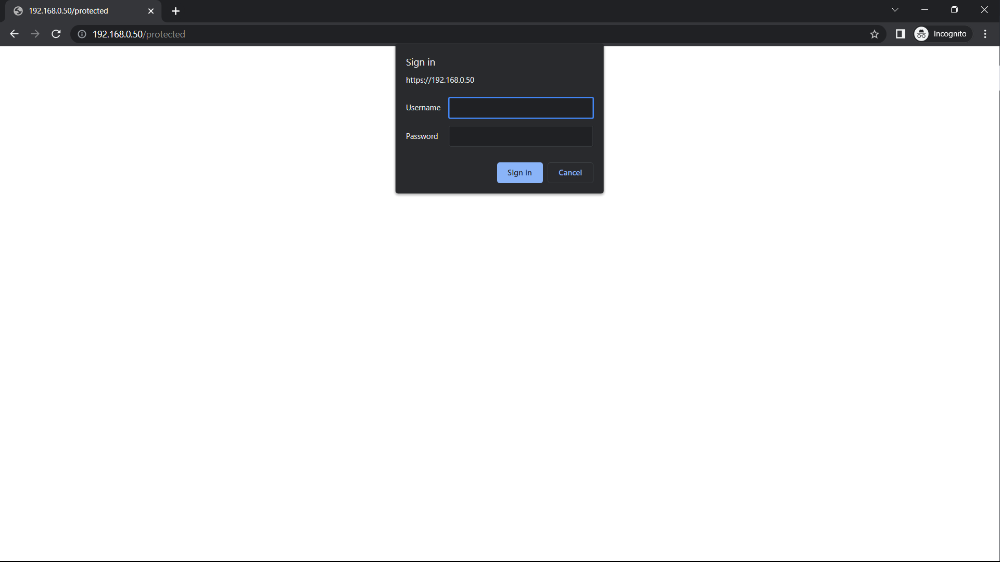

<a name="readme-top"></a>


# Nginx HTTP Authentication

<!-- ABOUT THE PROJECT -->
## About The Project

This project provide a simple way to manage users and provide basic access control using HTTP basic authentication and nginx auth_request. 

Notes: this project current only support HTTP basic authentication which must be used with SSL.

## Installation

### Docker Compose
```yaml
services:
    nginx-http-auth-request:
        image: ghcr.io/klementng/nginx-http-auth-request:latest
        container_name: nginx-http-auth-request
        environment:
            - CONFIG_DIR=/config
            - SETTINGS_PATH=/config/settings.yml
            - USER_DB_PATH=/config/settings.yml
            - USER_DB_MODE=YAML
        volumes:
            - /path/to/data:/config
        ports:
            - 9999:9999
        restart: unless-stopped
```
<p align="right">(<a href="#readme-top">back to top</a>)</p>

## Usage:

### Server Setup
Docker environmental variables:
<table>
  <tr>
    <th>Name</th>
    <th>Description</th>
    <th>Allowed values</th>
    <th>Default values</th>
  </tr>
  <tr>
    <td>CONFIG_DIR</td>
    <td>Working directory for storing configuration & data </td>
    <td>Any</td>
    <td>/config</td>
  </tr>
  <tr>
    <td>SETTINGS_PATH</td>
    <td>Path to settings file</td>
    <td>Any</td>
    <td>${CONFIG_DIR}/settings.yml</td>
  </tr>
  <tr>
    <td>USERS_DB_MODE</td>
    <td>Store users using yaml file or sqlite3 database.</td>
    <td>YAML | SQLITE3</td>
    <td>YAML</td>
  </tr>
  <tr>
    <td>USERS_DB_PATH</td>
    <td>Path to settings file</td>
    <td>Any</td>
    <td>yaml: SETTINGS_PATH | sqlite3: ${CONFIG_DIR}/data.db</td>
  </tr>
</table>  

### Managing Users
```bash
sudo docker run -it nginx-http-auth-request users add <username>
sudo docker run -it nginx-http-auth-request users edit <username>
sudo docker run -it nginx-http-auth-request users delete <username>
```
### Starting / killing server
```bash
sudo docker run -it nginx-http-auth-request start
sudo docker run -it nginx-http-auth-request kill
```

## Examples:

### Server configuration
```yaml
# This is the default configuration file

settings:
  server:
    host: '0.0.0.0' #listening ip address
    port: 9999      #listening port

modules:

  default: #i.e. http://localhost:9999/ or http://localhost:9999/default
    mode: local # use local database

    # http authentication parameters
    method: basic
    realm: default users

  admin: #i.e. http://localhost:9999/admin
    mode: local
    method: basic
    realm: admin users

    # restrict login to the following usernames:
    users:
      - admin

  upstream: #i.e. http://localhost:9999/upstream
    mode: upstream # do the password checking upstream

    method: basic
    realm: upstream users

    upstream:
      # kwargs as follows requests.request() see: https://requests.readthedocs.io/en/latest/api/ 
      # allow_redirects is set to false by default

      # <<username>> / <<password>> are replaced with user inputs

      method: POST
      url: https://www.example.com/authenticate
      data: >-
        {"Username":"<<username>>","Password":"<<password>>"}
      headers:
        Content-Type: application/json

      # json:
      #   Username: <<username>>
      #   Password: <<password>>
      
      users:
        - demo

users:
  # supported password format
  # text:plaintext_password
  # algo:iterations:b64(hash)
  # algo:iterations:b64(salt):b64(hash)

  #user1: text:password123
  user:  sha256:10000:///////////////////////abc==:8WR8KTAo2P0y9bRMkasWdKxpdBupkNBSLU4X6vz+bSg=
  admin: sha256:10000:abcdefghijklmnopQRSTUVWXYZ==:UuRV7et/zfAIWowdZswGbCBfArhIheeeVmAXBw7OsWo=
```

### Nginx configuration
```nginx
server {

    listen 443 ssl http2;
    listen [::]:443 ssl http2;

    server_name www.example.com;

    location /users {
      internal;

      proxy_set_header X-Original-URI $request_uri;

      location /users/default
      {
        proxy_pass http://localhost:9999/default;
      }

      location /users/admins
      {
        proxy_pass http://localhost:9999/admins;
      }

    }

    auth_request /users/default;

    location / {
        try_files $uri $uri/ =404;
    }

    location /protected {
        auth_request /users/admins;
    }
    
}
```

### Image



<p align="right">(<a href="#readme-top">back to top</a>)</p>
